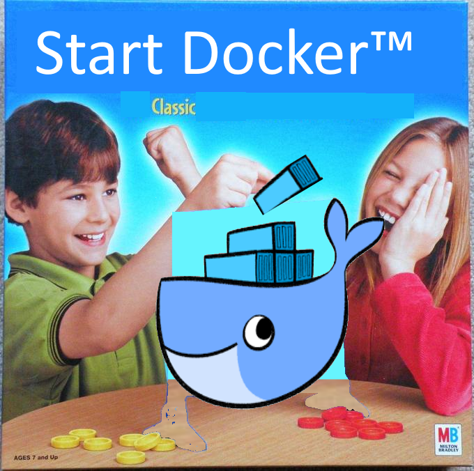
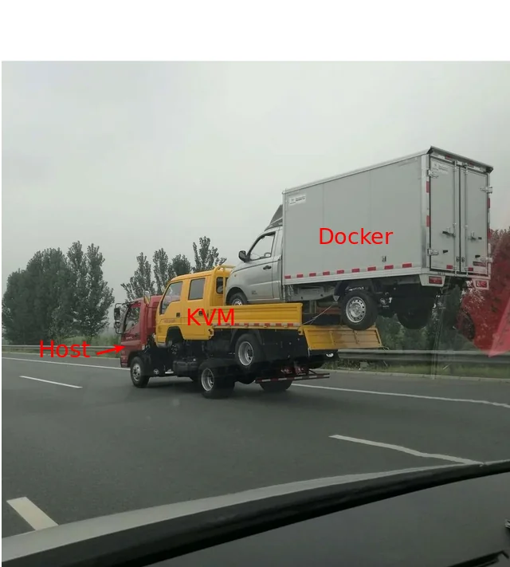

# Duck-Docker
some commands i noted down for you know, when i need them 🐳

```FROM
WORK
COPY
RUN
EXPOSE
CMD
```

## command to remember for a docker:
-   ```bash 
    docker build -t myapi . 
    ```
    - docker build command to build a docker image
    - `-t` allows you to tag a name in the image
    - `myFastAPI` name of the Docker image
    -  `.` docker will look for Dockerfile in current directory.

-   ```bash 
    docker run -d -p 8000:8002 myapi
    ```
    - `docker build` : command to build a docker image
    - ``-d`` detached mode, means run in the background
    - `-p 8000:8002`: maps port 8000 of your host machine to port 8002 of the container.
        - -p [host_port]:[container_port]
    - `myapi` image tag name

-   ```bash 
    docker ps -a
    ```
    - all running or exited image in docker 
-   ```bash 
    docker ps
    ```
    - all running images in docker
    
-   ```bash 
    docker logs "6691dc4e2c3f"
    ```
    - checks logs of image with container id "6691dc4e2c3f"

-   ```bash 
    docker stop [CONTAINER_ID] 
    ```
    - stops a docker container
-   ```bash 
    docker start [CONTAINER_ID]
    ```
    - start a docker container
- ```bash 
    docker rm [CONTAINER_ID]
    ```
    - removes the container
-   ```bash 
    docker stats
    ```
    - shows real time resource usage of all running containers

- ```bash 
    docker images
    ```
    - shows the docker images in system
- ```bash 
    docker rmi [IMAGE_ID]
    ```
    - deletes the images

# Docker Commands Guide

1. Create a Dockerfile:
   ```
   Dockerfile
   ```

2. Build a docker image:
   ```bash
   sudo docker build -t [docker image name] .
   ```

3. Create a docker container:
   ```bash
   sudo docker run -d --name [docker container name] -p 8002:8002 [docker image name]
   ```

4. View running docker containers:
   ```bash
   sudo docker ps -a
   ```

5. Stop a docker container:
   ```bash
   sudo docker stop [Container_id]
   ```

6. Restart a docker container:
   ```bash
   sudo docker start [Container_id]
   ```

7. Remove a docker container:
   ```bash
   sudo docker rm [Container_id]
   ```

8. List docker images:
   ```bash
   sudo docker images
   ```

9. Remove a docker image:
   ```bash
   sudo docker rmi [Image_id]
   ```

